```{r setup, include=FALSE}
knitr::opts_chunk$set(echo = FALSE)
```

## <b style = 'color : #0b5239'> Taller 1.2.1.3</b>

**<b style = 'color : #0b5239'> Lab - Compare Data with a Hash </b>**

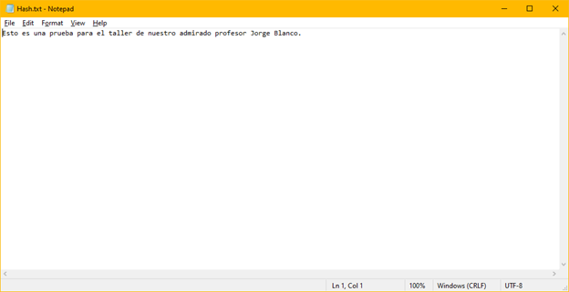{width="70%"}

## <b style = 'color : #0b5239'> 2 </b>

**<b style = 'color : #0b5239'>Lab - Compare Data with a Hash </b>**

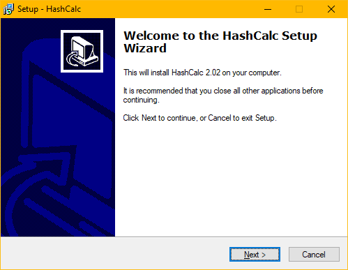{width="70%"}

## <b style = 'color : #0b5239'> 3 </b>

**<b style = 'color : #0b5239'>Lab - Compare Data with a Hash </b>**

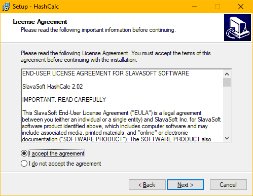{width="70%"}

## <b style = 'color : #0b5239'> 4 </b>

**<b style = 'color : #0b5239'>Lab - Compare Data with a Hash </b>**

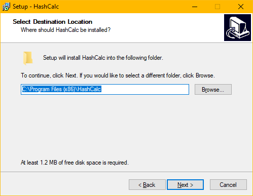{width="70%"}


## <b style = 'color : #0b5239'> 5 </b>

**<b style = 'color : #0b5239'>Lab - Compare Data with a Hash </b>**

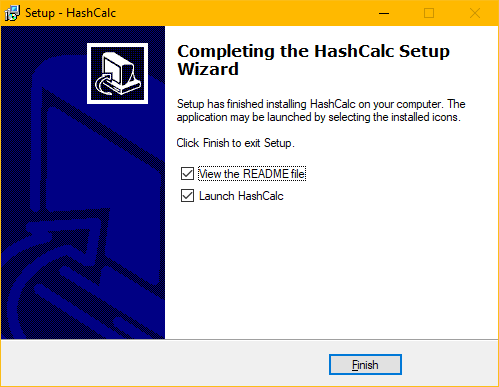{width="70%"}

## <b style = 'color : #0b5239'> 6 </b>

**<b style = 'color : #0b5239'>Lab - Compare Data with a Hash </b>**

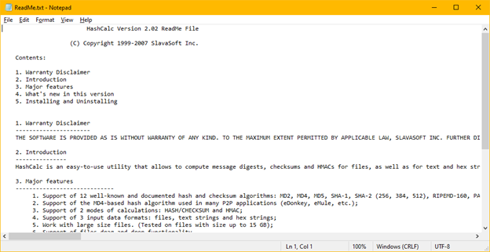{width="70%"}

## <b style = 'color : #0b5239'> 7 </b>

**<b style = 'color : #0b5239'>Lab - Compare Data with a Hash </b>**

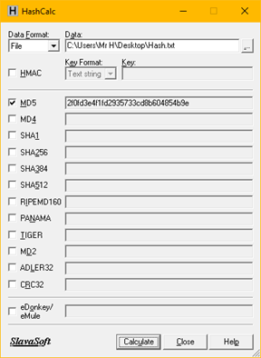{width="70%"}

## <b style = 'color : #0b5239'> 8 </b>

**<b style = 'color : #0b5239'>Lab - Compare Data with a Hash </b>**

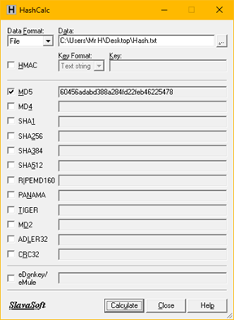{width="70%"}

## <b style = 'color : #0b5239'> 9 </b>

**<b style = 'color : #0b5239'>Lab - Compare Data with a Hash </b>**

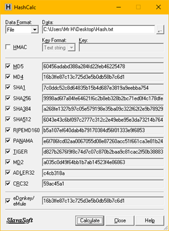{width="70%"}

## <b style = 'color : #0b5239'> Análisis del taller Comparar datos con un hash </b>


**<b style = 'color : #0b5239'>Muchos de los tipos de hash crean un hash de longitud diferente. ¿Por qué?</b>
**

**<b style = 'color : #0b5239'>Esto se debe a que los tipos de hash utilizan diferentes algoritmos, así como también determinan diferentes longitudes.</b>
 **


## <b style = 'color : #0b5239'> Taller 5.2.2.4 Lab - Using Digital Signatures </b>

**<b style = 'color : #0b5239'>Using Digital Signatures </b>**
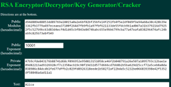{width="80%"}


## <b style = 'color : #0b5239'> Taller 5.2.2.4 Lab - Using Digital Signatures </b>
**<b style = 'color : #0b5239'>Using Digital Signatures </b>**
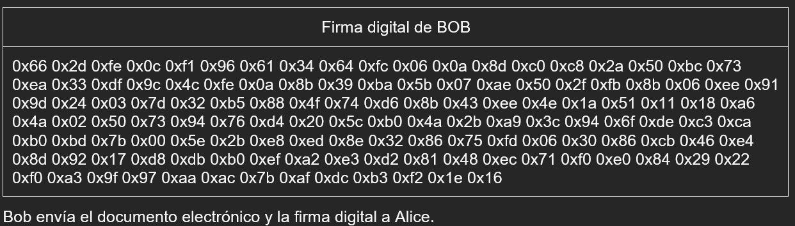{width="80%"}


## <b style = 'color : #0b5239'> Taller 5.2.2.4 Lab - Using Digital Signatures </b>
**<b style = 'color : #0b5239'>Using Digital Signatures </b>**
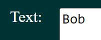{width="80%"}


## <b style = 'color : #0b5239'> Taller 5.2.2.4 Lab - Using Digital Signatures </b>

**<b style = 'color : #0b5239'>Using Digital Signatures </b>**
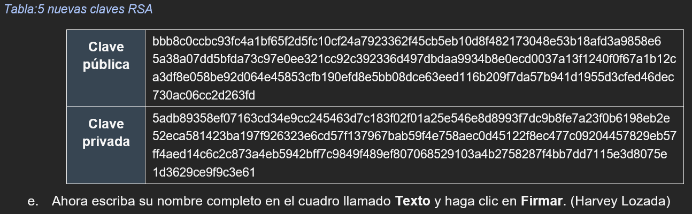{width="80%"}

## <b style = 'color : #0b5239'> Taller 5.2.2.4 Lab - Using Digital Signatures </b>

**<b style = 'color : #0b5239'>Using Digital Signatures </b>**
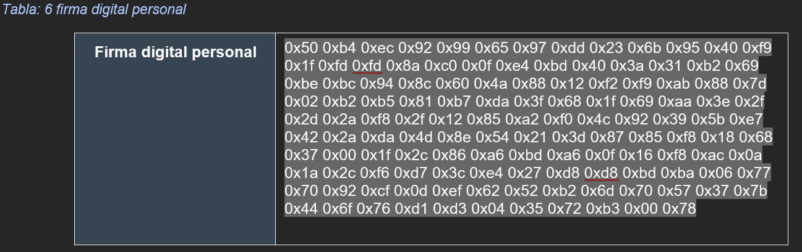{width="80%"}


## <b style = 'color : #0b5239'> Taller 5.2.2.4 Lab - Using Digital Signatures </b>

**<b style = 'color : #0b5239'>Para el año 2021 se presentaba un ataque por secuestro de información *(ransomware)* cada 11 segundos, se prevé que para el año 2031 los ataques serán de cada 2 segundos.</b>**


## <b style = 'color : #0b5239'> Análisis por ataques en los próximos 10 años </b>

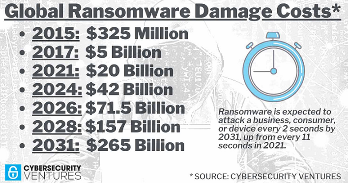{width="70%"}


## <b style = 'color : #0b5239'> Costos por Ransomware </b>

**<b style = 'color : #0b5239'>Para el año 2021 los costos por daño fueron de 20 mil millones de dólares, si los proyectamos a 10 años quiere decir que para el año 2031 podrían ser de 265 mil millones de dólares.</b>**

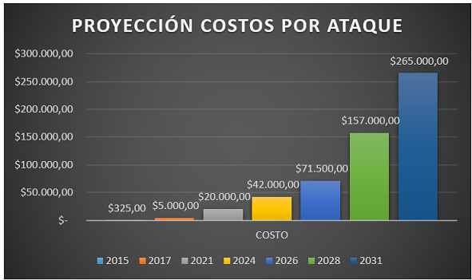{width="70%"}


## <b style = 'color : #0b5239'> Fin de la presentación - Gracias </b>

